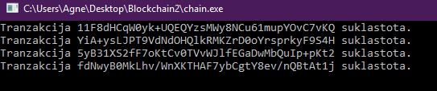
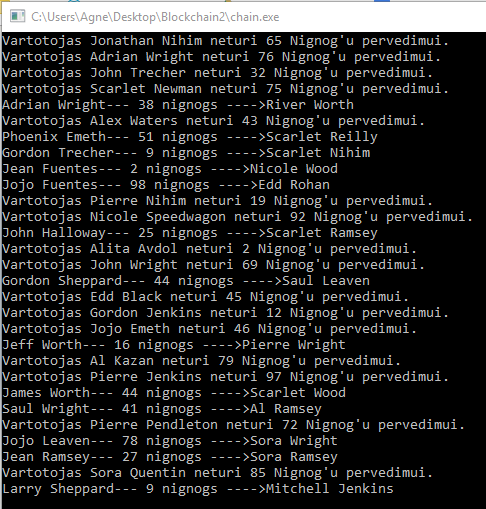

# Blockchain užduotis 2: bitcoin imitacija
## v0.2
Tranzakcijų validacija ir realistiškesnis blokų prijungimas prie grandinės. Taip pat vartotojai dabar turi tikrus vardus!

## Tranzakcijų validavimas: hash'as
Kiekviena tranzakcija dabar turi savo ID, kuris yra įeigos (mokančiojo public key), išeigos (to, kuriam moka, public key) ir Nignog'ų (mano valiuta) skaičiaus hash'as. Prieš įdedant tranzakciją į pool'ą patikrinama, ar minėtieji atributai susideda į ID. Jei ne, tranzakcija atmetama.

## Tranzakcijų validavimas: balanso tikrinimas
Nors tai ir centralizuota grandinė ir balansą būtų galima tikrinti tiesiai vartotojo piniginėje, tačiau aš pamaniau, jog įdomiau būtų tai padaryt labiau kaip veikia tikros kriptovaliutos. Prieš tranzakciją įdedant į bloką, pereinama visa grandinė, kiekvieno jos bloko tranzakcijos, pagal siuntėjo public key skaičiuojant, ar jis turi (ar jam buvo persiųsta)
reikiamą kiekį Nignog'ų. Jei ne tranzakcija atmetama. Tiesa, mano grandinėj genesis blokas yra sudarytas iš netikrinamų tranzakcijų, kad kai kurie vartotojai turėtų pervestų pinigų.
Čia feedback'as dedant tranzakcijas į bloką:

