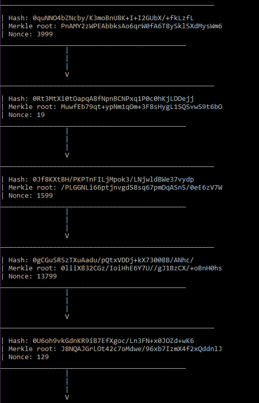

# Blockchain užduotis 2: bitcoin imitacija
## v0.1
Ši pirmoji programa sugeneruos 1000 vartotojų, 10000 tranzakcijų tarp jų ir eiliškai sudės jas į blokus po 100. Blokai bus "iškasti" ir įdėti į blockchain'ą (į vektorių). Grandinė atsivaizduos konsolėje.

## Bloko klasė
Blokas turi versiją (kol kas tiesiog palieku, kad ji visada 1), Merkle hash šaknį, laiko žymę, prieš tai ėjusio bloko hash'ą, nonce'ą, sudėtingumą (kol kas palieku visada 1, nes daugiau itin ilgai užtruktų iškasti) ir žinoma yra vieta bloko hash'ui, kuris sudaromas mano algoritmu užkoduojant atributus. Taip pat kūnas, kuriame saugomos tranzakcijos.
Galima kviesti tranzakcijos į kūną pridėjimo, merkle root skaičiavimo, "kasimo" metodus.

